# Navigation paths, as built

2026-10-09, at `ec3184a0`. The smith's quiz (the Workbench) is the centre; everything else is
reached from it or leads to it. An arrow is a click; its label is the control. Dashed arrows are
addresses typed or pasted, not controls. Nodes in the gear cluster are sections of one dialog.

```mermaid
flowchart TB
  gate["/  front door"] --> hunts["/my/hunts  hunts list"]
  hunts -.-> org["/~org  the org's hunts"]
  hunts -->|title| huntpage["/~org/hunt  hunt page"]
  hunts -->|gear| huntgear["HuntEditModal  title, label"]
  hunts -->|Categories| wheel["/~org/hunt/categories  wheel"]
  hunts -->|quiz link, mode by role| quiz
  hunts -->|Be someone else| gate
  huntpage -->|quiz link| quiz
  huntpage -->|The category wheel| wheel
  huntpage --> branch["Branch  switch"]
  huntpage --> hist1["History  download"]
  huntpage --> mem1["Members  read-only, points at the quiz's panel"]
  huntpage -.-> quizzes["/~org/hunt/quizzes"]
  quizzes -->|quiz link| quiz
  crumbs["breadcrumb: org, hunt"] --> org
  crumbs --> huntpage

  subgraph quiz["smith quiz   /~org/hunt/quizzes/home/quiz/!edit"]
    direction TB
    header["QuizHeader  title, smith's note in place"]
    switcher["QuizSwitcher  pick, + New quiz, lock"]
    toolbar["Toolbar  + Add question, select, sort, renumber"]
    grid["QuestionTable  rows edit in place, ask on double-click"]
    panels["Panels below the grid"]
  end
  quiz --- crumbs
  switcher -->|pick, + New quiz| quiz
  header -->|gear| gear

  subgraph gear["gear   QuizManageModal"]
    direction TB
    glabel["Label  explicit Relabel"]
    gcols["Columns  folding editor, + New column… menu"]
    gwid["Widgetings  run order, + New widgeting…, + New quiz widgeting…"]
    gtemp["Templates  templateable sources"]
    ghist["History  milestone, download"]
    ghunt["Hunt  name, label, link to wheel"]
    gall["All quizzes"]
    garch["Archived questions  un-archive, delete"]
    gdanger["Danger zone  delete quiz, or quiz and hunt"]
  end
  ghunt -->|Arrange the hunt's categories| wheel

  gcols -->|beneath a column showing one| wpanel["WidgetingPanel  label, description, params, columns showing, remove"]
  gwid -->|each row| wpanel
  gwid -->|+ New widgeting…| catalogue["NewWidgeting  the catalogue"]
  gcols -->|+ New column… › A new entry…| catalogue
  gcols -->|+ New column… › A new widget… admin| weditor
  catalogue -->|New widget… admin| weditor["WidgetEditor  Apply, Remove"]
  wpanel -->|Edit the widget… admin| weditor
  gwid -->|Widget library…| library["LibraryModal  list, ⚙, + New widget…"]
  toolbar -->|Widget library| library
  library -->|⚙, + New widget…| weditor

  subgraph panels_g["panels"]
    direction TB
    previews["Reviews  read"]
    pspread["Spread  chart of the wheel, no link"]
    pmembers["Members  add, remove, Review this quiz"]
    pentries["Quiz entries  type in place"]
    pexim["Export/Import  Spreadsheet, Raw Export, Import, Library, Full History, LL Export"]
    pwidgets["Widgets  readout, points at the gear"]
    precap["Recap  head, tail, template in place"]
  end
  panels --- panels_g
  pmembers -->|Review this quiz| playtest["/…/quiz/!playtest  ReviewScreen"]
  pexim -->|Library tab| libtab["import_widgets, copy out"]
```

## What the picture says

* **Three doors into the library, none of them a page.** The toolbar and the gear each open the
  modal; the Library tab is the bulk door. The widget editor is reached four ways. A noun that
  belongs to no hunt is navigated only through a quiz.
* **The gear is the quiz's gearbox and half the hunt's.** Hunt name, label and the wheel's link
  sit in a quiz's dialog; the hunt page has the branch and not much else.
* **Two readouts point instead of opening**: the hunt page's Members and the Widgets panel.
* **Playtest is reached from the Members panel** (the link a smith pastes), from the hunts list
  for a reviewer, and by address. Nothing on the review screen leads back to the hunt but the
  breadcrumb.
* **The quizzes page is reached by nothing**: no link on the hunt page or the breadcrumb goes to
  it. Typed addresses only.
