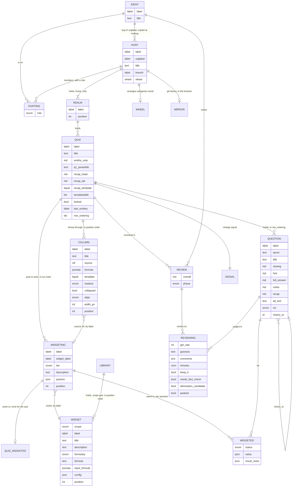

# Data relations, as built

2026-10-09, at `ec3184a0`, from `convex/schema.ts` and the row validators in `src/models/`. Rows,
not a tree; children are read through their parent's index and refer to each other by label
where exports must round-trip (a widgeting names its widget by label; a column's source names a
widgeting by label; `chains_to` is the one id reference a question holds).

## What the picture says

* **Two trees and a library.** The hunt's tree (realm, quiz, question, column, widgeting,
  widgeted) and the ident's (hunting, review, reviewing) meet at the quiz. The library stands
  apart, joined by a label.
* **The hunt's own fields are few** (title, label, org, branch, wheel) and each is edited
  somewhere different: title and label in two dialogs, branch on the hunt page, wheel on its own
  page.
* **A column points at a widgeting, a widgeting at a widget**: the chain the folding editor
  draws, a widgeting folded beneath its column and the widget behind a door in the widgeting's
  panel. The navigation follows the relation here, exactly.
* **Members and reviews hang off the hunt and the quiz, not off a page.** Both are addressed
  (`/members`, `/reviews/{ident}`) and neither is served.
